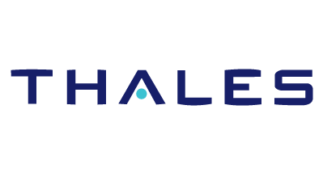



  <!-- Stack the columns on mobile by making one full-width and the other half-width -->
  

    

      
    

    

        

            <strong>Software Engineering Intern</strong> 
            Thales 
            Jul 2018 - Present 
            Sydney, Australia 
            

                <ul>
                    <li>Realising a complex engineering testing tool which interfaces with a drone management and validation system to simulate 100's of drones as a Software Engineer in a team of 3</li>
                    <li>Created and maintaining 4 reusable networking libraries and a major Front-End map component implemented across projects.</li>
                    <li>Implementing the MEAN Stack including an implementation of a complex <strong>REST & STOMP</strong> Interface. </li>
                    <li>Knowledge leveraged: <strong>JavaScript/TypeScript, Angular, Git, MongoDB, C++, Unreal Engine.</strong> </li>
                </ul>
            

        

    

  

  <!-- New Row-->
  

    

      
    

    

        

            <strong>Software Engineering Intern</strong> 
            OzEducation 
            Jan 2017 - Nov 2017 
            Sydney, Australia 
            

                <ul>
                    <li>Primary developer a large-scale Childcare Management System serving 8 childcare centres and 1 administration branch.</li>
                    <li>Performed Requirements Analysis through 6 sprints to write up 30+ issues. </li>
                    <li>Developed a demonstrable prototype within 6 months;extended it to target the Chinese market in 4 months.</li>
                    <li>Knowledge leveraged: <strong> NodeJS, JavaScript, AngularJS, SQL, Android, NFC, DevOps, Alibaba Cloud.</strong> </li>
                </ul>
            

        

    

  

  <!-- New Row-->
  

    

      
    

    

        

            <strong>Software Automation Intern</strong> 
            Abuzz 
            Aug 2016 - Dec 2016 
            Sydney, Australia 
            

                <ul>
                    <li>Developed programs and scripts to enhance and automate digital workflow.</li>
                    <li>Automated the common task of importing store lists to save 2 days' worth of manual data entry time.</li>
                    <li>Implemented a basic scripting language in Java.</li>
                    <li>Knowledge leveraged: <strong>Java, BASH and JavaScript.</strong> </li>
                </ul>
            

        

    

  

